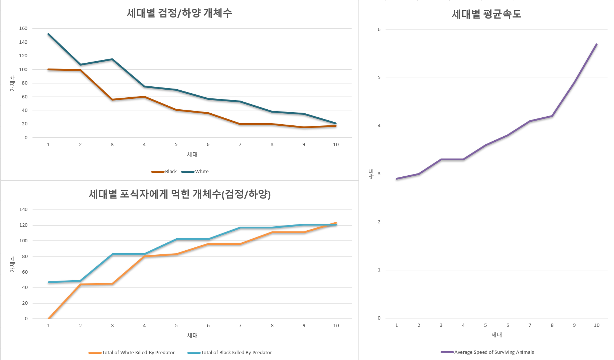

# README.md

전체 코드는 제 깃허브에 올라와 있습니다.
 → https://github.com/alfonso-john2021/natural_selection
아래는 코드 설명입니다. 

코드의 목표는 간소화된 생태계 시뮬레이션의 구현이다. 환경(Environment), 생물(Animal), 포식자(Predator), 음식(Food)의 상호작용을 통해 생태계의 변화를 관찰할 수 있다. 각 생물은 속도, 식사 속도, 색상과 같은 특성을 가지며, 세대가 넘어가며 변이가 일어나고, 이는 진화와 생존에 영향을 미친다.

또한 pandas 라이브러리를 활용하여 세대별 출력값을 엑셀 파일에 저장하고, 이 과정을 반복해 값을 누적시켜 랜덤성 요소를 최소화하고 경향성을 확인하였다.

**환경(Environment) 클래스**

- 시뮬레이션의 크기(size)와 상태를 관리한다.
- 생물, 포식자, 음식을 저장하며, 세대(generation) 관리와 시뮬레이션 업데이트 기능을 포함한다.
- `next_generation()` 메서드를 통해 생물의 진화를 처리한다.
- Update() 메서드를 통해 시뮬레이션 속 1틱당 일어나는 일들을 제어한다. 한 세대당 틱을 조절해 각 세대의 길이를, 1초당 틱을 설정해 시뮬레이션 속도를 조절 할 수 있다. 현재는 최대 10세대까지 변화 과정을 추적한다. 한 세대당 500틱으로, 초당 1000틱으로 설정된 상태이다. 다만 연산 과정에서 시간이 걸리므로, 실제 실행 시간은 이보다 훨씬 길다.
- `render_map()` 메서드를 통해 현재 상태를 출력한다. ->비활성화된 상태

**생물(Animal) 클래스**

- 생물의 속성을 정의하고, 이동, 음식 찾기  로직을 포함한다.
유전적 변이를 통해 자식 개체를 생성한다.

**포식자(Predator) 클래스**

- 포식자의 속성을 정의하고, 무작위로 이동하는 기능을 포함한다.

**음식(Food) 클래스**

- 음식의 위치를 랜덤하게 정의한다.

## 문제 1

실패. 환경에 따른 동물의 색의 경향성을 계산하려고 했더니 하얀색 배경에서 검정색이 우위를 보임

→원래는 하얀색 배경에서 하얀색 동물이 우위를 가져야함. 

### 해결

코드를 자세히 살펴보니 자식에게 유전하며 변이가 발생하는데, 이때 하얀색과 검정색 중 선택하는 과정에서 무조건 검정색으로 많이 변하도록 코드가 잘못 작성되어 있었음.

```python
...
elif mutation_type == 'color':
            if self.color == "white":
			          if random.randint(0,9) <= 6:
					          pass
					      else:
							      self.color = 'black'
```

```python
...
elif mutation_type == 'color':
            if self.color == 'white':
                if random.random() >= 0.25:
                    pass
                else :
                    self.color = 'black'
            if self.color == 'black':
                if random.random() >= 0.25:
                    pass
                else :
                    self.color = 'white'
```

<이전 코드와 개선된 코드>

개선된 코드에서는 자손에게 색이 유지될 확률 75%, 변경될 확률 25%로 색을 유전시키면서도 변이가 일어날 수 있게함.

## 문제 2

시뮬레이션을 다시 돌려본 결과 동물의 개체수가 유지는 되나, 뚜렷한 경향성을 보여주지 못함.

### 해결

환경의 먹이 제공량과, 포식자와 만났을 경우의 생존 확인 알고리즘을 개선함.

매 세대당 먹이 제공량을 줄이고, 생존 확인 알고리즘에서 배경 색과 개체의 색이 다를 경우의 불이익을 늘렸음.

## 문제 3

개체수가 계속해서 감소하는 경향을 보임. 색과 환경의 차이가 뚜렷하게 드러나지 않음.

### 해결

개체수가 줄어든 원인을 두가지로 분리함.

1. 환경에 의해 포식자의 눈에 띄어 먹힌 경우
2. 먹이를 먹지 못해 죽은 경우.

세대별 출력값을 통해 이를 구분하였음.

```python
Generation 10:
Survived Animals: 34:
Total Predators_kill_white: 120:
Total Predators_kill_black: 131:
Random Animal - Food Count: 90.0, Speed: 8, Color: white
Average Speed of Surviving Animals: 4.47
Average Food Eaten by Surviving Animals: 83.02
Colors of Surviving Animals: black, white
Black: 18
White: 16
```

[10세대의 출력값 중 하나]

첫번째 원인의 경우 총 세가지 상황에서 이를 확인 할 수 있다.

1. 배경(서식지)의 색이 검정색인 경우 → 검정색 개체가 하얀색 개체에 비해 포식자에 의해 압도적으로 더 많이 살아남음
2. 배경(서식지)의 색이 하얀색인 경우 → 하얀색 개체가 검정색 개체에 비해 포식자에 의해 압도적으로 더 많이 살아남음(정반대)
3. 배경(서식지)의 색이 한 세대 마다 계속하여 바뀔 경우 → 두 개체의 개체 수와, 포식자에 의해 죽임당한 수가 오차범위(+-10)내에서 거의 동일함.
    
    
    

[3번 경우의 분석결과]

두번째 원인의 경우는 같은 틱 동안 움직일 수 있는 범위가 큰 속도가 빠른 개체가 유리하여, 전체 개체 평균 속도가 증가하는 경향을 보임. 다만 환경적 요소와 관계가 없기에, 두 종류의 개체에 모두 공통적으로 적용되어 전체 개체수가 줄어드는 결과를 보였다.

# 결론

이를 통해 자연 선택에 의해 먹이를 더 잘 먹고, 포식자에게 잘 먹히지 않는 방향으로 진화하게 됨을 알 수 있었음. 또한 문제상황에서 해결 방안을 다각도로 탐구하고, 적용하는 방법을 알게 됨.